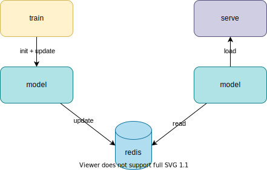

# Online Training & Serving (FM with model in DB)



## Set up

```
python -m venv venv
source venv/bin/activate
```

river development mode

```
pip install -e "$HOME/repos/nakamasato/river[dev]"
```

```
```

## Run in local
1. Start redis
    1. Run on MacOS:
        ```bash
        brew install redis # install redis
        brew services restart redis # start redis
        ```

        ref: https://redis.io/docs/getting-started/installation/install-redis-on-mac-os/

    1. Run with Docker
        ```
        docker run --name redis -d -p 6379:6379 redis redis-server --appendonly yes
        ```
1. Train

    ```
    python train.py
    ```
1. Serve
    ```
    flask --app serve --debug run
    ```

## Model Parameters (FFM)
- `intercept`: `w_0`
- `weights`: `collections.defaultdict(weight_initializer)` (`weight_initializer` is `optim.initializers.Zeros()` by default) -> `0`
    ```py
    if weight_initializer is None:
        weight_initializer = optim.initializers.Zeros()
    self.weight_initializer = weight_initializer
    self.weights = collections.defaultdict(weight_initializer)
    ```
- `latents`: set with `_init_latents()`
    ```py
    def _init_latents(self):
        random_latents = functools.partial(self.latent_initializer, shape=self.n_factors)
        field_latents_dict = functools.partial(collections.defaultdict, random_latents)
        return collections.defaultdict(field_latents_dict)
    ```
    - `latent_initializer`: `optim.initializers.Normal(mu=0.0, sigma=0.05, seed=73)`

    Check:
    ```py
    from river import optim
    latent_initializer = optim.initializers.Normal(mu=0.0, sigma=0.05, seed=73)
    random_latents = functools.partial(latent_initializer, shape=10)
    field_latents_dict = functools.partial(collections.defaultdict, random_latents)
    latents = collections.defaultdict(field_latents_dict)
    ```

Check the model parameters

```py
print(
    f"intercept: {regressor.steps['FFMRegressor'].intercept}\n"
    f"weights: {regressor.steps['FFMRegressor'].weights}\n"
    f"latents: {regressor.steps['FFMRegressor'].latents}\n"
)
```

## redis-collections

https://pypi.org/project/redis-collections/


1. Start redis in local
1. Use `Dict` with `redis`
    ```py
    import redis
    conn = redis.StrictRedis(host='localhost', port=6379, db=0)
    d = Dict(redis=conn)
    d['answer'] = 42
    d
    <redis_collections.Dict at 16503da8870f450797e4da0ed44870d6 {}>
    ```
1. You can check in redis

    ```
    redis-cli
    127.0.0.1:6379> keys *
    1) "16503da8870f450797e4da0ed44870d6"
    ```

## FFM with redis-connections

1. Change river library to support inject model parameters ([9fa9196](https://github.com/nakamasato/river/commit/9fa9196d89906baff31aa07c9ed6ae0bca78639d))

1. Initialize model with `redis_collections.DefaultDict`

    ```py
    # redis
    conn = redis.StrictRedis(host="localhost", port=6379, db=0)

    # init latents with DefaultDict
    latent_initializer = optim.initializers.Normal(mu=0.0, sigma=0.05, seed=73)
    random_latents = functools.partial(latent_initializer, shape=10)
    field_latents_dict = functools.partial(defaultdict, random_latents)
    latents = DefaultDict(field_latents_dict, key="ffm_latents", redis=conn)

    # init weights
    weight_initializer = optim.initializers.Zeros()
    weights = DefaultDict(weight_initializer, key="ffm_weights", redis=conn)

    ffm_params = {
        "n_factors": 10,
        "weight_optimizer": optim.SGD(0.01),
        "latent_optimizer": optim.SGD(0.025),
        "intercept": 3, # w_0
        "weights": weights, # w_1
        "latents": latents, # v
    }
    ```
1. Train
    ```
    python train.py
    ```
    Training Time: 0:33 -> 3:48 (7 times slower!)

1. Compare the result.
    1. Normal:

    <details>

    ```
    2. FFMRegressor
    ---------------
    Name                                                 Value      Weight     Contribution
                                             Intercept    1.00000    3.30421        3.30421
                                              user_259    1.00000    0.19651        0.19651
                                         user_gender_M    1.00000    0.17253        0.17253
                                    item_genre_romance    0.50000    0.12949        0.06474
    item_genre_comedy(item) - item_genre_romance(item)    0.25000    0.25027        0.06257
        user_gender_M(item) - item_genre_romance(user)    0.50000    0.10976        0.05488
       user_age_19-32(item) - item_genre_romance(user)    0.50000    0.01654        0.00827
            user_gender_M(user) - user_age_19-32(user)    1.00000    0.00762        0.00762
                       item_255(user) - user_259(item)    1.00000    0.00638        0.00638
                 user_age_19-32(item) - item_255(user)    1.00000    0.00165        0.00165
             item_genre_romance(user) - user_259(item)    0.50000   -0.01216       -0.00608
                  user_gender_M(user) - user_259(user)    1.00000   -0.00759       -0.00759
              item_genre_comedy(user) - user_259(item)    0.50000   -0.01956       -0.00978
                                              item_255    1.00000   -0.01207       -0.01207
                 user_age_19-32(user) - user_259(user)    1.00000   -0.01229       -0.01229
         user_gender_M(item) - item_genre_comedy(user)    0.50000   -0.02949       -0.01475
             item_genre_romance(item) - item_255(item)    0.50000   -0.04683       -0.02342
        user_age_19-32(item) - item_genre_comedy(user)    0.50000   -0.05965       -0.02983
              item_genre_comedy(item) - item_255(item)    0.50000   -0.08998       -0.04499
                  user_gender_M(item) - item_255(user)    1.00000   -0.06442       -0.06442
                                        user_age_19-32    1.00000   -0.10942       -0.10942
                                     item_genre_comedy    0.50000   -0.31690       -0.15845

    Prediction: 3.38628
    ```

    </details>

    1. With Redis:

    <details>

    ```
    2. FFMRegressor
    ---------------
    Name                                                 Value      Weight     Contribution
                                             Intercept    1.00000    3.19325        3.19325
                                         user_gender_M    1.00000    0.29110        0.29110
                                              user_259    1.00000    0.26451        0.26451
                                    item_genre_romance    0.50000    0.16608        0.08304
                 user_age_19-32(item) - item_255(user)    1.00000    0.03544        0.03544
       user_age_19-32(item) - item_genre_romance(user)    0.50000    0.05789        0.02895
        user_gender_M(item) - item_genre_romance(user)    0.50000    0.04710        0.02355
                       item_255(user) - user_259(item)    1.00000    0.02167        0.02167
             item_genre_romance(item) - item_255(item)    0.50000    0.01166        0.00583
    item_genre_comedy(item) - item_genre_romance(item)    0.25000    0.02124        0.00531
              item_genre_comedy(item) - item_255(item)    0.50000    0.00964        0.00482
             item_genre_romance(user) - user_259(item)    0.50000    0.00807        0.00403
            user_gender_M(user) - user_age_19-32(user)    1.00000    0.00189        0.00189
                  user_gender_M(user) - user_259(user)    1.00000   -0.00215       -0.00215
              item_genre_comedy(user) - user_259(item)    0.50000   -0.00666       -0.00333
                 user_age_19-32(user) - user_259(user)    1.00000   -0.00391       -0.00391
         user_gender_M(item) - item_genre_comedy(user)    0.50000   -0.01211       -0.00605
        user_age_19-32(item) - item_genre_comedy(user)    0.50000   -0.04351       -0.02175
                  user_gender_M(item) - item_255(user)    1.00000   -0.02232       -0.02232
                                        user_age_19-32    1.00000   -0.02340       -0.02340
                                              item_255    1.00000   -0.05703       -0.05703
                                     item_genre_comedy    0.50000   -0.29354       -0.14677

    Prediction: 3.67667
    ```

    </details>

## Serve the model with Flask app

1. Create a simple Flask app

    ```py
    def create_app():

        # create and configure the app
        app = Flask(__name__, instance_relative_config=True)

        model = init_model_with_redis()

        @app.route("/", methods=["GET"])
        def predict():
            payload = request.json
            print(payload)
            print(model.debug_one(payload))
            res = model.predict_one(payload)
            return {"pred": res}

        return app

    def init_model_with_redis():
        # initialize the model in the same way as in train.py
    ```

1. Run Flask app

    ```
    flask --app serve --debug run
    ```

1. Send a sample request
    ```
    curl -X GET http://localhost:5000/ -H "Content-Type: application/json" -d @predict-data.json
    {
    "pred": 3.7189399340891476
    }
    ```
