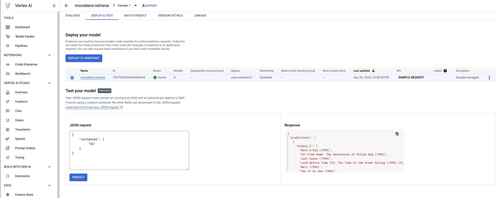

# Movielens - Serving retrieve model

## Prerequisite

Model is already saved in GCS ([Train a Retrieve Model](README_retrieve_train.md))

```
gcloud storage ls --project $PROJECT gs://${PROJECT}-ml-training/movielens/cloudrun/retrieve/model-output/
```

## Option1: Deploy to Vertex AI Endpoint

### [Import model from GCS](https://cloud.google.com/vertex-ai/docs/model-registry/import-model#custom-container)

With the following command, we load the model built with Vertex AI:

```
gcloud ai models upload \
  --region=$REGION \
  --display-name=movielens-retrieve \
  --container-image-uri=asia-docker.pkg.dev/vertex-ai-restricted/prediction/tf_opt-cpu.nightly:latest \
  --artifact-uri=gs://${PROJECT}-ml-training/movielens/vertexai/model-output/model/ \
  --project=$PROJECT
```

```
gcloud ai models list --project $PROJECT --region $REGION
RETRIEVE_MODEL_ID             DISPLAY_NAME
2548324905556901888  movielens-retrieve
```

- **artifact-uri**: the directory that contains your model artifacts (`saved_model.pb` for TensorFlow)
- **container image uri**: The URI of the container image to use for serving predictions.
    - https://cloud.google.com/vertex-ai/docs/predictions/pre-built-containers
    - https://cloud.google.com/vertex-ai/docs/predictions/optimized-tensorflow-runtime

### [Deploy model to endpoint](https://cloud.google.com/vertex-ai/docs/general/deployment)

Create a new endpoint (not dedicated endpoint for traffic split)

```
gcloud ai endpoints create \
  --region=$REGION \
  --display-name=movielens-retrieve --project $PROJECT
```

<details><summary>alternatively dedicated endpoint</summary>

Here, we deploy the model to a dedicated endpoint

```
curl -X POST \
-H "Authorization: Bearer $(gcloud auth print-access-token)" \
-H "Content-Type: application/json" \
-d '{"display_name": "movielens-retrieve", "dedicatedEndpointEnabled": true}' \
https://$REGION-aiplatform.googleapis.com/v1/projects/$PROJECT/locations/$REGION/endpoints
```

> [!WARN] The create operation is invisible and it takes time to get visible by `gcloud ai endpoints list --region $REGION --project $PROJECT`.

</details>

Check the endpoint

```
gcloud ai endpoints list --region=$REGION --project $PROJECT
ENDPOINT_ID          DISPLAY_NAME
2891702386911346688  movielens
```

Deploy the latest model

```
RETRIEVE_ENDPOINT=$(gcloud ai endpoints list --region=$REGION --filter=display_name=movielens-retrieve --project $PROJECT --format="json(name)" | jq -r '.[0].name')
RETRIEVE_MODEL_ID=$(gcloud ai models list --filter=display_name=movielens-retrieve --region $REGION --project $PROJECT --sort-by=~versionUpdateTime --format 'json(name)' | jq -r '.[0].name' | sed 's/.*\/\(\d*\)/\1/')
```

```
gcloud ai endpoints deploy-model $RETRIEVE_ENDPOINT \
  --region=$REGION \
  --model=$RETRIEVE_MODEL_ID \
  --display-name=movielens-retrieve \
  --machine-type=n2-standard-2 \
  --min-replica-count=1 \
  --max-replica-count=1 \
  --traffic-split=0=100 \
  --project $PROJECT
```

> [!INFO]
> This takes 5~10 mins.

Check your endpoint

```
gcloud ai endpoints describe $RETRIEVE_ENDPOINT \
    --project=$PROJECT \
    --region=$REGION
```


### Predict

prepare `input_data_file_retrieve.json`:

```json
{
    "instances": [
         "42"
    ]
}
```

```
export RETRIEVE_ENDPOINT_ID=$(gcloud ai endpoints list --region=$REGION --filter=display_name=movielens-retrieve --project $PROJECT --format="json(name)" | jq -r '.[0].name' | sed 's/.*\/\(\d*\)/\1/')
INPUT_DATA_FILE=tensorflow/examples/movielens/input_data_file_retrieve.json
```

```
curl \
-X POST \
-H "Authorization: Bearer $(gcloud auth print-access-token)" \
-H "Content-Type: application/json" \
"https://$REGION-aiplatform.googleapis.com/v1/projects/$PROJECT/locations/$REGION/endpoints/$RETRIEVE_ENDPOINT_ID:predict" \
-d "@${INPUT_DATA_FILE}"
```

> [!NOTE]
> If you encounter the following error
>
> ```
> {
>   "error": {
>     "code": 400,
>     "message": "This endpoint is a dedicated endpoint via CloudESF and cannot be accessed through the Vertex AI API. Please access the endpoint using its dedicated dns name '<endpoint_id>.asia-northeast1-<project number>.prediction.vertexai.goog'",
>     "status": "FAILED_PRECONDITION"
>   }
> }
> ```
> you can use the following command:
> ```
> DEDICATED_DNS=$(gcloud ai endpoints describe $RETRIEVE_ENDPOINT \
>    --project=$PROJECT \
>    --region=$REGION --format json | jq -r '.dedicatedEndpointDns')
> ```


Result:

```json
{
  "predictions": [
    {
      "output_2": [
        "Rent-a-Kid (1995)",
        "Far From Home: The Adventures of Yellow Dog (1995)",
        "Just Cause (1995)",
        "Land Before Time III: The Time of the Great Giving (1995) (V)",
        "Nell (1994)",
        "Two if by Sea (1996)",
        "Jack (1996)",
        "Panther (1995)",
        "House Arrest (1996)",
        "Conan the Barbarian (1981)"
      ],
      "output_1": [
        3.94025946,
        3.47775483,
        3.4017539,
        3.32554197,
        2.95510435,
        2.63177681,
        2.61488819,
        2.61403036,
        2.58744907,
        2.54093599
      ]
    }
  ],
  "deployedModelId": "535000367843246080",
  "model": "projects/xxxx/locations/asia-northeast1/models/2548324905556901888",
  "modelDisplayName": "movielens-retrieve",
  "modelVersionId": "1"
}
```



### Undeploy

```
RETRIEVE_ENDPOINT=$(gcloud ai endpoints list --region=$REGION --filter=display_name=movielens-retrieve --project $PROJECT --format="json(name)" | jq -r '.[0].name')
RETRIEVE_MODEL_ID=$(gcloud ai models list --filter=display_name=movielens-retrieve --region $REGION --project $PROJECT --sort-by=~versionUpdateTime --format 'json(name)' | jq -r '.[0].name' | sed 's/.*\/\(\d*\)/\1/')
DEPLOYED_RETRIEVE_MODEL_ID=$(gcloud ai models describe $RETRIEVE_MODEL_ID --region $REGION --project $PROJECT --format 'json('deployedModels')' | jq -r '.deployedModels[].deployedModelId')
gcloud ai endpoints undeploy-model $RETRIEVE_ENDPOINT \
    --project=$PROJECT \
    --region=$REGION \
    --deployed-model-id=$DEPLOYED_RETRIEVE_MODEL_ID
```

```
gcloud ai endpoints delete $RETRIEVE_ENDPOINT \
    --project=$PROJECT \
    --region=$REGION
```

## Option2: Deploy to Cloud Run with TFX Serving

- https://www.tensorflow.org/tfx/serving/serving_basic
- https://keras.io/examples/keras_recipes/tf_serving/

Build serving container (copy the model from gcs to docker image)

```
cd tensorflow/examples/movielens/
gcloud builds submit \
    --config "cloudbuild.serving.yaml" \
    --project "${PROJECT}" \
    --substitutions="_IMAGE_TAG=${IMAGE_TAG},_IMAGE_NAME=movielens-retrieve,_REPOSITORY=${REPOSITORY},_REGION=${REGION},_PROJECT=${PROJECT},_EXPORT_BUCKET=gs://$PROJECT-ml-training/movielens/cloudrun/retrieve/" \
    --gcs-source-staging-dir="gs://${PROJECT}-cloudbuild/source"
```

This copis model from `gs://$PROJECT-ml-training/movielens/cloudrun/retrieve/` to `models/` dir and then, the image contains the model files under `/models/` (e.g. `/models/retrieve/1/`)


```
gcloud run deploy movielens-retrieve \
    --image=$REGION-docker.pkg.dev/$PROJECT/$REPOSITORY/movielens-retrieve:$IMAGE_TAG \
    --port=8501 \
    --region=$REGION \
    --execution-environment=gen2 \
    --no-allow-unauthenticated \
    --project=$PROJECT \
    --set-env-vars=MODEL_NAME="retrieve" \
    --set-env-vars=MODEL_BASE_PATH=/models/
```

```
RETRIEVE_URL=$(gcloud run services describe movielens-retrieve \
    --region=$REGION \
    --project=$PROJECT --format json | jq -r '.status.url'); echo $RETRIEVE_URL
```


```
curl \
-X POST \
-H "Authorization: Bearer $(gcloud auth print-identity-token)" \
-H "Content-Type: application/json" \
"$RETRIEVE_URL/v1/models/retrieve:predict" \
-d "@tensorflow/examples/movielens/input_data_file_retrieve.json"
```

Result ✅️

```
{
    "predictions": [
        {
            "output_1": [4.44376183, 3.91096044, 3.30788016, 3.2474885, 3.09820199, 3.05463862, 2.8976388, 2.8413763, 2.81197762, 2.80637932],
            "output_2": ["Rent-a-Kid (1995)", "House Arrest (1996)", "Land Before Time III: The Time of the Great Giving (1995) (V)", "All Dogs Go to Heaven 2 (1996)", "Mirage (1995)", "Just Cause (1995)", "Paper, The (1994)", "Aristocats, The (1970)", "Love in the Afternoon (1957)", "Conan the Barbarian (1981)"]
        }
    ]
}
```

## Ref

- https://github.com/guillaumeblaquiere/cloudrun-tensorflow-prediction/tree/master
