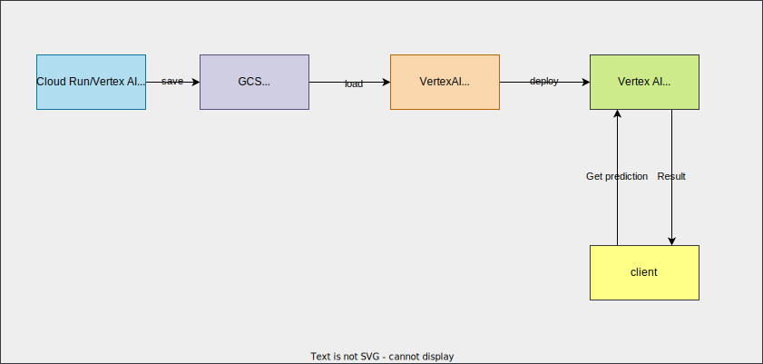

# Movielens - Train Retrieve model



You can also check

- [Vertex AI でレコメンデーションモデルを使う (Custom Training + Deploy to endpoint + Prediction)](https://qiita.com/nakamasato/items/ddf778aef32f3a8421c3)
- [Step-by-Step: Develop a Recommendation System Using Vertex AI (From Custom Training to Deployment with MovieLens dataset)](https://nakamasato.medium.com/step-by-step-develop-a-recommendation-system-using-vertex-ai-from-custom-training-to-deployment-54a4bd31b285)

## Build and push to GCP AR

Custom Container:
- https://cloud.google.com/vertex-ai/docs/training/containers-overview
- https://cloud.google.com/vertex-ai/docs/training/code-requirements

```
export PROJECT=<your project>
```

```
export REGION=asia-northeast1
export REPOSITORY=ml-training
export IMAGE=movielens
export APP=retrieve
export IMAGE_TAG=0.0.1
```


```
poetry export -f requirements.txt --output tensorflow/examples/movielens/requirements.txt --only=tensorflow --without-hashes
```

build locally

```
pack build --platform linux/amd64 --builder heroku/builder:22 $IMAGE --path tensorflow/examples/movielens
```

run locally

```
docker run --rm $IMAGE python retrieve.py
```

build and publish (❌)

mac: `--platform linux/amd64`
linux: `--platform linux/amd64`

```
gcloud auth login
gcloud auth configure-docker asia-northeast1-docker.pkg.dev
pack build "$REGION-docker.pkg.dev/$PROJECT/$REPOSITORY/$IMAGE:$IMAGE_TAG" \
    --env "GOOGLE_ENTRYPOINT='web: python retrieve.py'" \
    --tag "$REGION-docker.pkg.dev/$PROJECT/$REPOSITORY/$IMAGE:latest" \
    --path tensorflow/examples/movielens \
    --builder heroku/builder:22 \
    --publish
```

```
docker buildx build --platform linux/amd64 -f tensorflow/examples/movielens/Dockerfile -t $IMAGE:$IMAGE_TAG tensorflow/examples/movielens
docker tag $IMAGE:$IMAGE_TAG "$REGION-docker.pkg.dev/$PROJECT/$REPOSITORY/$IMAGE:$IMAGE_TAG"
docker push "$REGION-docker.pkg.dev/$PROJECT/$REPOSITORY/$IMAGE:$IMAGE_TAG"
```

> [!WARN]
> Local build didn't work due to the following error
> -> `terminated: Application failed to start: "/usr/local/bin/python" exec format error`

```
cd tensorflow/examples/movielens/
gcloud builds submit \
    --config "cloudbuild.train.yaml" \
    --project "${PROJECT}" \
    --substitutions="_IMAGE_TAG=${IMAGE_TAG},_IMAGE_NAME=${IMAGE},_REPOSITORY=${REPOSITORY},_REGION=${REGION},_PROJECT=${PROJECT}" \
    --gcs-source-staging-dir="gs://${PROJECT}-cloudbuild/source"
```

## Train Model

### Option1: Train model on Cloud Run ✅️

memo: `--command=python --args=retrieve.py --set-env-vars=PYTHONPATH=/workspace/` for image built by buildpacks

```
gcloud run jobs deploy ml-training-movielens-retrieve --args=retrieve.py --memory 4Gi --cpu 2 --image "$REGION-docker.pkg.dev/$PROJECT/$REPOSITORY/$IMAGE:$IMAGE_TAG" --set-env-vars=AIP_MODEL_DIR=gs://${PROJECT}-ml-training/movielens/cloudrun/retrieve --set-env-vars=TF_USE_LEGACY_KERAS=1 --max-retries 0 --region $REGION --project $PROJECT
```

```
gcloud run jobs execute ml-training-movielens-retrieve --region $REGION --project $PROJECT
```

> [!WARN]
> `"ValueError: Cannot convert '('c', 'o', 'u', 'n', 't', 'e', 'r')' to a shape. Found invalid entry 'c' of type '<class 'str'>'. "`

-> `--set-env-vars=TF_USE_LEGACY_KERAS=1` is necessary ✅️

You can check the saved model:

```
gcloud storage ls "gs://${PROJECT}-ml-training/movielens/cloudrun/retrieve/1/"
gs://PROJECT-ml-training/movielens/cloudrun/retrieve/1/

gs://PROJECT-ml-training/movielens/cloudrun/retrieve/1/:
gs://PROJECT-ml-training/movielens/cloudrun/retrieve/1/
gs://PROJECT-ml-training/movielens/cloudrun/retrieve/1/fingerprint.pb
gs://PROJECT-ml-training/movielens/cloudrun/retrieve/1/keras_metadata.pb
gs://PROJECT-ml-training/movielens/cloudrun/retrieve/1/saved_model.pb
gs://PROJECT-ml-training/movielens/cloudrun/retrieve/1/assets/
gs://PROJECT-ml-training/movielens/cloudrun/retrieve/1/model/
gs://PROJECT-ml-training/movielens/cloudrun/retrieve/1/variables/
```

### Option2: Train model on VertexAI ✅️

> [!WARN]
>
> Local Run (❌️ `WARNING: The requested image's platform (linux/amd64) does not match the detected host platform (linux/arm64/v8) and no specific platform was requested`)
>
> ```
> gcloud ai custom-jobs local-run --executor-image-uri="$REGION-docker.pkg.dev/$PROJECT/$REPOSITORY/$IMAGE:$IMAGE_TAG" --project $PROJECT
> ```

Submit Custom Job without autopacking

- [Create Custom Job with gcloud](https://cloud.google.com/vertex-ai/docs/training/create-custom-job#create_custom_job-gcloud)
- [Envvar for special GCS dir](https://cloud.google.com/vertex-ai/docs/training/code-requirements#environment-variables)

Prepare config file

```
APP=retrieve envsubst < tensorflow/examples/movielens/vertexaiconfig.template.yaml > tensorflow/examples/movielens/vertexaiconfig.retrieve.yaml
```

Submit job

```
gcloud ai custom-jobs create --region=$REGION --display-name="movielens-retrieve" --config=tensorflow/examples/movielens/vertexaiconfig.retrieve.yaml --project $PROJECT
```
